# Projet 3 "La classification d’images pour détecter le cancer de la peau"
###### Réalisé par : *Zaynab ROMENE*
#
Le but de ce projet est d'analyser les images afin de détecter la présence d'un cancer de la peau. Puisque c'est un projet académique, on s'est concentré sur un seul type de cancer "le mélanome". Il s'agit alors d'une classification binaire. C'est-à-dire l'algorithme détecte s'il s'agit d'un cancer mélanome ou bien un cas normal. À chaque fois le mélanome est détecté  avec un pourcentage qui dépasse 80%, on fait clignoter la LED. Ceci est fait à l'aide d'un modèle d'intelligence artificielle qu'on va entrainer de deux manières différentes.

# Table des matières
[1- Matériel utilisé (Hardware)]()   
[2- La base de données (Database) ]()    
[3- Entrainement du modéle et résultats]()      
&nbsp;&nbsp;&nbsp;&nbsp; [3-1- Méthode1: Entraînement du modéle avec EDGE IMPULSE]()   
&nbsp;&nbsp;&nbsp;&nbsp;&nbsp;&nbsp;&nbsp;&nbsp; [3-1-1-Le software utilisé]()  
&nbsp;&nbsp;&nbsp;&nbsp;&nbsp;&nbsp;&nbsp;&nbsp; [3-1-2-Les étapes d'entrainement]()  
&nbsp;&nbsp;&nbsp;&nbsp;&nbsp;&nbsp;&nbsp;&nbsp;&nbsp;&nbsp;&nbsp;&nbsp;&nbsp;&nbsp;&nbsp;&nbsp; [3-1-2-1- Connecter la carte au compte Edge Impulse]()  
&nbsp;&nbsp;&nbsp;&nbsp;&nbsp;&nbsp;&nbsp;&nbsp;&nbsp;&nbsp;&nbsp;&nbsp;&nbsp;&nbsp;&nbsp;&nbsp; [3-1-2-2- Acquérir des données]()  
&nbsp;&nbsp;&nbsp;&nbsp;&nbsp;&nbsp;&nbsp;&nbsp;&nbsp;&nbsp;&nbsp;&nbsp;&nbsp;&nbsp;&nbsp;&nbsp; [3-1-2-3- Créer une impulse]()  
&nbsp;&nbsp;&nbsp;&nbsp;&nbsp;&nbsp;&nbsp;&nbsp;&nbsp;&nbsp;&nbsp;&nbsp;&nbsp;&nbsp;&nbsp;&nbsp; [3-1-2-4- Former le modèle]()  
&nbsp;&nbsp;&nbsp;&nbsp;&nbsp;&nbsp;&nbsp;&nbsp;&nbsp;&nbsp;&nbsp;&nbsp;&nbsp;&nbsp;&nbsp;&nbsp; [3-1-2-5- Tester est télécharger le modèle]()  
&nbsp;&nbsp;&nbsp;&nbsp;&nbsp;&nbsp;&nbsp;&nbsp; [3-1-3- Partie Arduino (Méthode1)]()  
&nbsp;&nbsp;&nbsp;&nbsp;&nbsp;&nbsp;&nbsp;&nbsp; [3-1-4- Résultat (Méthode1)]()  
&nbsp;&nbsp;&nbsp;&nbsp;  [3-2- Méthode2: Entrainement du modéle avec Jupyter Notebook]()  
&nbsp;&nbsp;&nbsp;&nbsp;&nbsp;&nbsp;&nbsp;&nbsp; [3-2-1- Le software utilisé]()  
&nbsp;&nbsp;&nbsp;&nbsp;&nbsp;&nbsp;&nbsp;&nbsp; [3-2-2- Les étapes d'entrainement]()  
&nbsp;&nbsp;&nbsp;&nbsp;&nbsp;&nbsp;&nbsp;&nbsp; [3-2-3- Partie Arduino (Méthode2)]()  
&nbsp;&nbsp;&nbsp;&nbsp;&nbsp;&nbsp;&nbsp;&nbsp; [3-2-4- Résultat (Méthode2)]()  
[Ressouces](## Ressources :)  

## 1- Matériel utilisé (Hardware)
Nous utilisons le Kit d'apprentissage Tiny ML d'arduino pour explorer l'Embedded Machine Learning.C'est une nouvelle technologie qui active l'intelligence artificielle juste à côté du monde physique à l'aide des données récupérées par les capteurs. Ce kit comprend un Arduino Nano 33 BLE Sense. Il est basé sur le microcontrôleur nRF52840 et fonctionne sur le système d'exploitation Arm® Mbed™. Le Nano 33 BLE Sense offre non seulement la possibilité de se connecter via Bluetooth® Low Energy, mais est également équipée de capteurs pour détecter la couleur, la proximité, le mouvement, la température, l'humidité, l'audio et plus encore. Vous pouvez cliquer sur l'image ci-dessous pour plus de détails ou bien il suffit de lire [le datasheet de la carte][df4].  
[](https://docs.arduino.cc/hardware/nano-33-ble-sense)  

Le processeur est caractérisé par : 
* 64 MHz Arm® Cortex-M4F (with FPU)
* 1 MB Flash + 256 KB RAM  

Ce qui nous intéresse dans ce projet c'est le module caméra OV7675 qui sera fixée sur une carte d'interface ou autrement dit un bouclier ( shield en anglais). Cette carte d'extension Arduino est déjà incluse dans le kit et sert à faciliter la fixation des composants.  

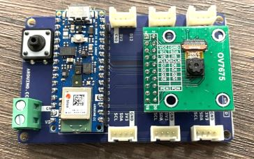  

Avant de commencer le projet, il est important de tester le bon fonctionnement de Hardware afin d'éviter toute sorte de problème. On a fait ça en suivant [ce tutoriel][df1] (page 24).   
Les caractéristiques de ce module sont: 
- Image Sensor: OV7675
- Image Area: 1640 x 1220 µm
- Optical Format: 1/9 inch
- Resolution: VGA (640×480)
- Frame Rate: Full @ 30 fps
- ELF: 1.8mm, F. NO: 2.8
- View Angle: 58°±3°
- Distortion: <1.0%
- Image Quality: ≥200LW/PH(AT=0.23M)

## 2- La base de données (Database)
On utilise dans ce projet [la banque de données suivante][df2]. Elle est constituée de 2357 images de maladies oncologiques malignes et bénignes, qui ont été formées à partir de l'International Skin Imaging Collaboration (ISIC). Toutes les images ont été triées selon la classification prise avec ISIC selon le type de cancer : kératose actinique, carcinome basocellulaire , dermatofibrome, mélanome, naevus , kératose bénigne pigmentée, kératose séborrhéique, carcinome squameux et lésion vasculaire. 
Puisqu'il s'agit d'un projet académique, on a choisi Le mélanome car la quantité d'images et légèrement dominate. On utilise 16 images pour le test et 430 images pour entrainer le modèle.

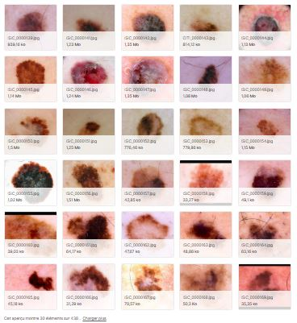

Pour information, le mélanome est en général Asymétrique, il a des Bords irréguliers, encochés, polycycliques, une Couleur inhomogène, allant du brun clair au noir foncé, un diamètre en général supérieur à 6 mm.

Afin d'établir une classification binaire, on a collecté une base d'images de peaux normales et saines ( non atteintes de cancer) d'aprés [un site internet][df3]. Et on les a convertis du format *.tif* au format *.jpg*.
On utilise pour ce projet 16 images de peau normale pour le test et 430 pour l'entraînement.

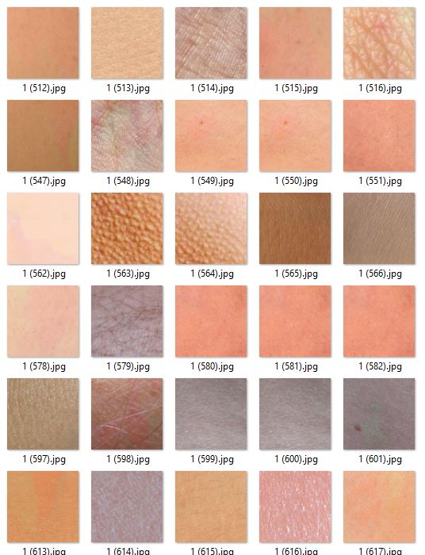

La couleur de la peau humaine normale est, dans la majorité des cas, homogène, nette et d'une couleur unie. En général, elle ne contient pas des tâches ou des changements brusques de couleur. Bien évidemment, ça peut y arriver. Mais au cours de ce projet on traite le cas le plus simple et plus visible pour détecter le cancer parce que le module caméra de TinyMl n'est pas une caméra médicale.

## 3- Entrainement du modéle et résultats
### 3-1- Méthode1: Entrainement du modéle avec EDGE IMPULSE
#### 3-1-1- Le software utilisé
Edge Impulse c'est un site qui permet de faire l'acquisition des données qui serviront à entrainer une IA. L'acquisition peut être faite à l'aide des capteurs du capteur ou bien par plusieurs autres alternatives.En proposant, une approche simplifiée de l'intelligence artificielle à l'aide des blocs, il permet d'entrainer le modèle avec la possibilité de personnaliser les paramètres. Ensuite, il fournit le code à implanter dans le microcontrôleur afin d'utiliser le réseau entrainé ous peuvent avoir plus d'informations en cliquant sur l'image suivante:  

[](https://www.edgeimpulse.com/)  

Bien évidemment , on utilise l'IDE de la carte Arduino pour la programmation de la carte et pour utiliser le modèle entrainé. Vous pouvez avoir plus d'informations en cliquant sur l'image suivante:  
[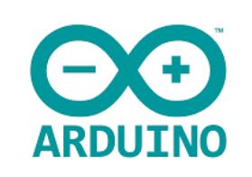](https://www.arduino.cc/)  

#### 3-1-2- Les étapes d'entrainement
##### 3-1-2-1- Connecter la carte au compte Edge Impulse
Il faut créer un compte Edge impulse et connecter la carte en utilisant cette [ vidéo Youtube][df3] et ce [document][df2]. Ceci est fait en téléchargeant le fichier compressé de Edge Impulse sur le PC et puis la dernière version du firmware dans la carte. Une fois le "flashing" est terminé, on appuie une fois sur le bouton RESET pour lancer le nouveau firmware. On lance ensuite la commande dans le terminal :
```sh
edge-impulse-daemon
```
Ceci va nous permettre de connecter la carte directement au compte Edge Impulse en écrivant juste l'adresse et le mot de passe. Par la suite, la carte sera visible sur le tableau de bord d'Edge Impulse.

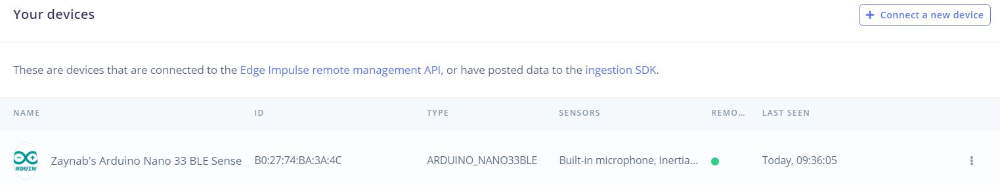

##### 3-1-2-2- Acquérir des données
Une fois les images téléchargées et étiquetées, il faut s'assurer d'avoir un bon ratio de répartition des données d'entraînement / test d'environ 80/20 pour les données de tests et pour les données d'entrainement.


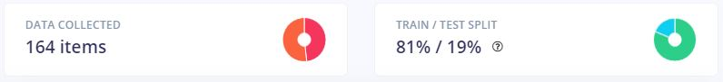


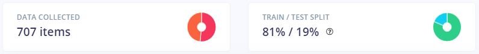  

##### 3-1-2-3- Créer une impulse 
Dans le menu, accédez à "Créer Impulse" sous "Impulse Design" et ajoutez un bloc de traitement d'images ainsi qu'un bloc d'apprentissage Transfer Learning 
- un bloc de traitement " a processing bloc" : J'ai choisi  le bloc "Image" qui prétraite et normalise les données d'image, et éventuellement réduit la profondeur de couleur.
- un bloc d'apprentissage " a learning bloc" : J'ai choisi le bloc "Transfer Learning (Images)" qui affine le modèle de classification d'images pré-entraîné.

J'ai remarqué que la taille de l'image affecte directement la taille de modèle et la précision du modèle. En premier lieu j'ai utilisé des images 48x48. Puis, j'ai opté ensuite pour des images de taille 96x96 de haute résolution. C'est la meilleure option à choisir pour avoir le meilleur rapport précision/taille  après beaucoup des tests faits. 

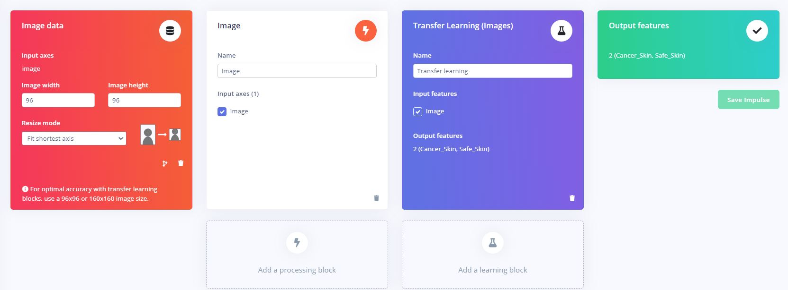  

On passe ensuite à la génération des caractéristiques à partir des données d'entrée. J'ai réglé la profondeur de couleur sur "RVB" et enregistrez les paramètres. On obtient une visualisation 2D. Cette dernière permet d'inspecter visuellement les groupes d'images en ce qui concerne leurs propriétés.

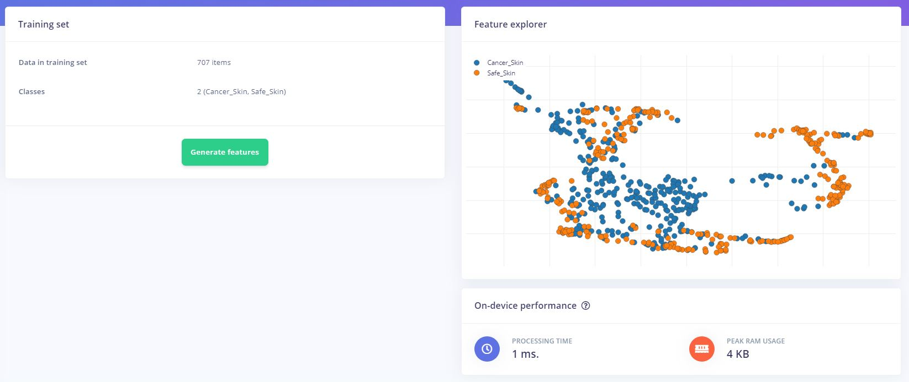  

##### 3-1-2-4- Former le modèle 
Suite à l'utilisation de mobile net V2 0.35, j'ai obtenu un modèle qui occupe 346.9k de la RAM. Ceci est inacceptable étant donnée que la RAM de ma carte est 256k. Pour corriger ce problème, j'avais le choix entre réduire les dimensions des images utilisées et changer l'architecture du modèle au Mobile Net V2 0.2. Après plusieurs essais, j'ai opté pour le changement de l'architecture.   

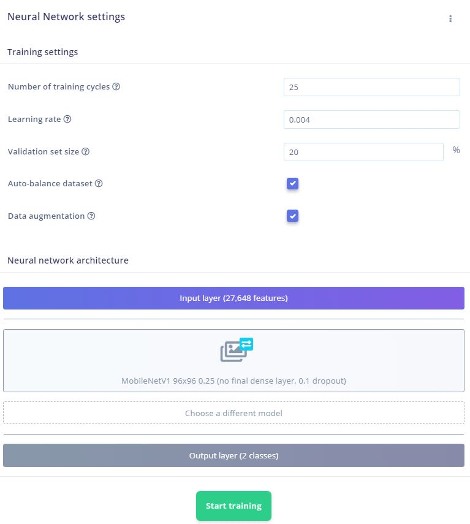  

Le choix prix m'a donné des résultats très satisfaisantes. La précision de modèle est de 98.6%. Et le taille de modèle est 130.9k ce qui est totalement acceptable (<256 k).

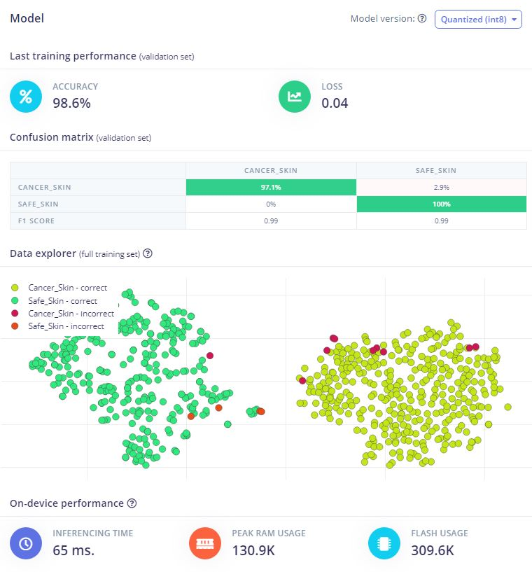   

##### 3-1-2-5- Tester est télécharger le modèle 
Afin de vérifier les perfomances du modéle, j'ai testé le modéle sur Edge Impulse avant de le déployer.

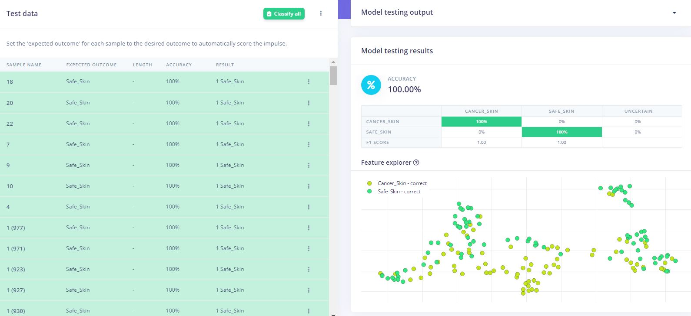  

Le modèle ML est formé et déjà optimisé pour être utilisé avec des microcontrôleurs. Cela se fait automatiquement en arrière-plan grâce à la quantification. 

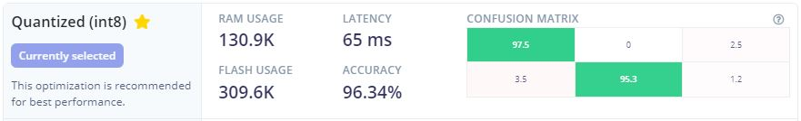   

On déploie alors le modèle et on le télécharge sous format  zip.

#### 3-1-3- Partie Arduino (Méthode1)
On inclut le fichier *ei-project3-arduino-1.0.2.zip* qu'on a téléchargé comme une librairie Arduino. Dans *File -> Examples -> final_project_inferencing-> nano_ble33_sense* on touve le code exemple qu'on va utiliser *nano_ble33_sense_camera*.
On commence par essayer le code et vérifier qu'il n’y a pas des problèmes à corriger. Puis, on ajoute les commentaires et quelques bouts de code dans les bons emplacements dans ce code exemple.

```sh
Serial.println("Done by : Zaynab ROMENE");
```
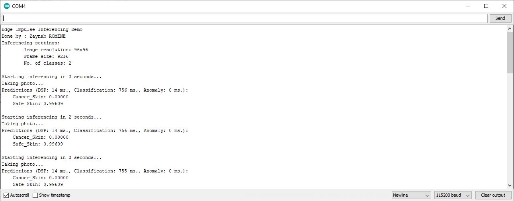  

On ajoute aussi les lignes de code qui permettent d'allumer la LED rouge si un cancer est détecté et allumer la LED verte is la peau est saine. 

```sh
        //Controling the LEDs based on the image detected 
        if ((result.classification[1].value) > (result.classification[0].value)) {
           //Cancer detected
           digitalWrite(LEDG, LOW);
           digitalWrite(LEDR, HIGH);
           delay(1000);
           digitalWrite(LEDR, LOW);
           digitalWrite(LEDG, LOW);
           delay(1000);
           } else {
           //No cancer detected
           digitalWrite(LEDG, HIGH);
           digitalWrite(LEDR, LOW);
           delay(1000);
           digitalWrite(LEDG, LOW);
           digitalWrite(LEDR, LOW);
           delay(1000);
           };
  ```
#### 3-1-4- Résultat (Méthode1)
Après plusieurs tests, j'ai remarqué que les résultats du modèle sont bien précis et que la caméra est performante pour cette application. Les pourcentages affiches sont toujours supérieurs à 85% comme il est montré dans les photos suivantes.

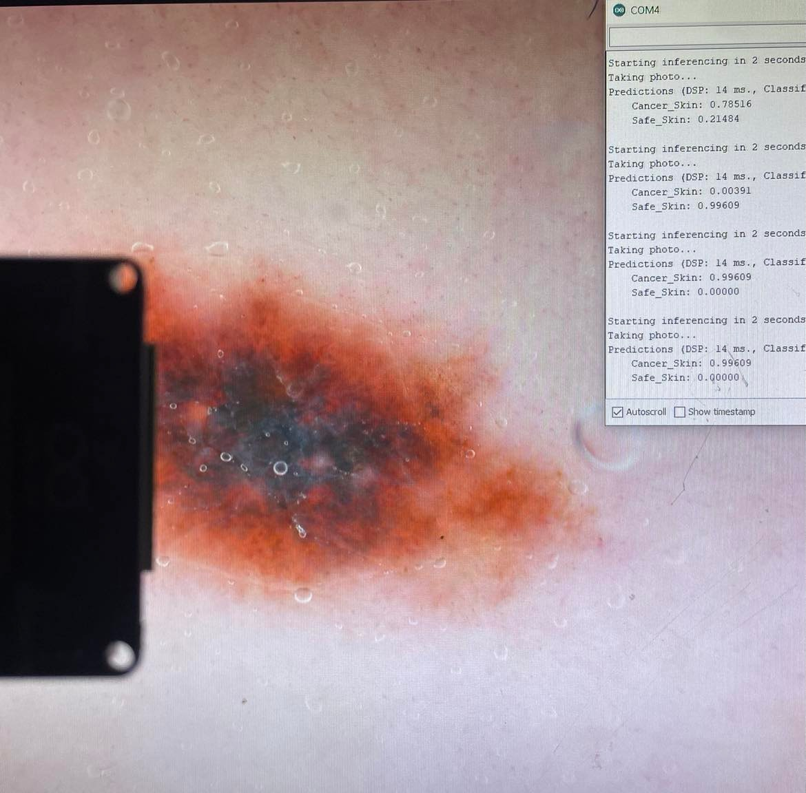  

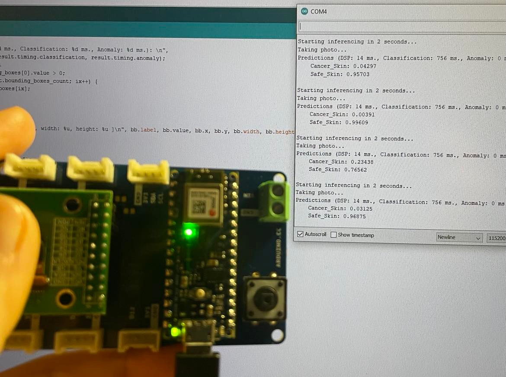  

### 3-2- Méthode2: Entraînement du modéle avec Jupyter Notebook
#### 3-2-1- Le software utilisé
Jupyter notebook c'est un outil qui permet d'exécuter des lignes de code en python. Il est utilisé pour des nombreuses applications comme l'analyse de données ou le traitement d'images. Dans notre cas, on l'utilise pour entrainer et générer un modèle de machine Learning.  

[](https://jupyter.org/)  

Bien évidemment , on utilise l'IDE de la carte Arduino pour la programmation de la carte et pour utiliser le modèle entrainé. Vous pouvez avoir plus d'informations en cliquant sur l'image suivante:  

[](https://www.arduino.cc/)  

J'ai choisi, cette fois-ci, d'utiliser Google Colab pour écrire le notebook. Colab est un environnement particulièrement adapté au machine learning. Il permet à n'importe qui d'écrire et d'exécuter le code Python de son choix par le biais du navigateur.  

[](https://colab.research.google.com/)  

#### 3-2-2- Les étapes d'entrainement
Pour entraîner le modèle d'apprentissage automatique et en profondeur, on peut utiliser un jupyter notebook qu'on le programme en Python. J'ai utilisé pour ce faire, l'environnement  google collab pour écrire le notebook [Skin-Cancer-Classifier ][df5].
Bien évidemment, je me suis inspirée des tutoriels et des expériences des autres personnes. J'ai mis tous les liens dans la partie ressources.

La première étape consiste à l'installation des bibliothéques. J'ai utilisé *TensorFlow Lite Model Maker* pour créer un modèle avec mon ensemble de données personnalisé. La bibliothèque TensorFlow Lite Model Maker simplifie le processus d'adaptation et de conversion d'un modèle de réseau de neurones TensorFlow en données d'entrée particulières lors du déploiement de ce modèle pour les applications ML sur l'appareil. 
On télécharge aussi d'autres bibliothéques indisponsables pour le fonctionnement du modèle.

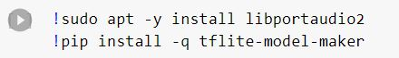  

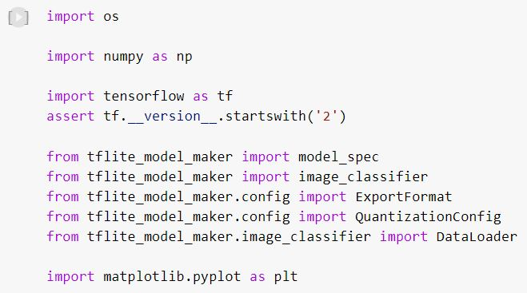  

La deuxième étape est la préparation de la base de données. On met toute les images dans un endroit bien spécifique dans le drive. Ce sont  des images appartenant à deux classes (Cancer_Skin ou Safe_Skin). Cet ensemble de données est conçu pour être utile pour l'analyse comparative et le test de la vision par ordinateur embarquée, car il représente une tâche très courante, à savoir la classification binaire, que nous devons accomplir avec des contraintes de ressources strictes. 
Puis, on définit le chemin d'accès à nos données d'image. 

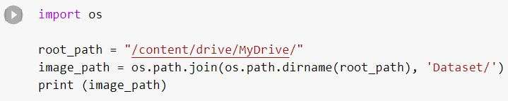  

Pour éviter les problèmes qui se produisent pendant le téléchargement, il faut éliminer  le .ipynb_checkpointqui est un dossier caché. Un correctif pour cela est que vous pouvez supprimer manuellement le dossier en utilisant:

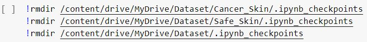  

Pour utiliser les données, il faut faire des répartitions. La première répartition est de 80/20 entre les données d'entraînement et les données de test et validation.

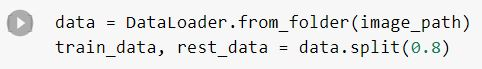  

La deuxième répartition est de 50/50 des données de test et validation (20% de toute la data) en données de test et données de validation (séparées).

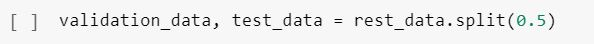  

On peut afficher 25 exemples d'images avec des étiquettes (labels) juste pour vérifier que les deux classes (catégories) d'images ont été bien lues.

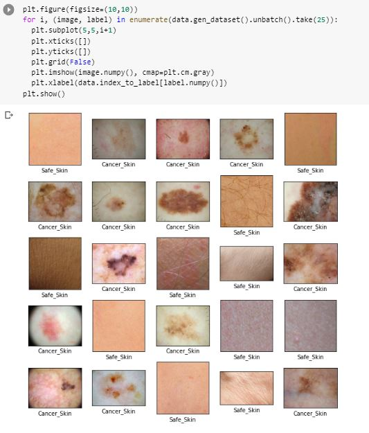  

On installe la version 2.7 de tensor flow afin de corriger un problème de compilation du modèle.

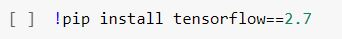  

Python a de nombreux modules dans sa bibliothèque standard, et celui qui aide ici est imghdr. Il vous permet d'identifier le type d'image contenu dans un fichier. L'imghdr peut reconnaître les types d'images suivants : rgb, gif, pbm, pgm, ppm, tiff, rast, xbm, jpeg/jpg, bmp, png, webp et exr. C'est indispensable de vérifier si l'image est utilisable ou non avant de générer le modèle. On peut  rechercher un type d'image, pas un nom d'extension, par le code suivant:

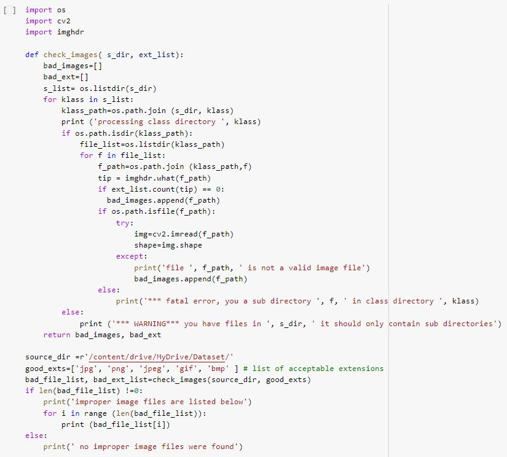  

On passe maintenant à l'entraînement du modèle. Les paramaitres sont:
- Les données d'entraînement seront utilisées pour réellement former le modèle.
- Les données de validation seront utilisées pour vérifier les performances du modèle après chaque cycle d'entraînement.
- Le nombre d'époques qui définit le nombre de cycles d'entraînement (plus il y a d'époques, plus votre modèle mettra de temps à s'entraîner)
- La spécification du modèle qui est un modèle d'image générique pré-entraîné.

J'ai utilisé EfficientNet-Lite*, MobileNetV2, ResNet50 en tant que modèles pré-formés pour la classification des images. Mais il est possible d'ajouter de nouveaux modèles pré-formés à cette bibliothèque avec seulement quelques lignes de code.

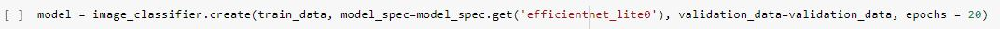  

Lorsque l'exécution se termine, on évalue le modèle en utilisant les données de test qu'il n'a jamais vues auparavant. Cette comparaison avec les données de test "test_data" nous donne une idée sur l'adaptabilité de modèle et ses performances.

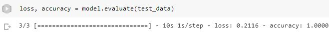  

Ensuite, On convertit le modèle existant au format de modèle TensorFlow Lite et on enregistre les étiquettes d'image dans le fichier d'étiquettes (labels). Le nom de fichier TFLite par défaut est model.tflite, le nom de fichier d'étiquette ( fichier qui contient les labels) est label.txt. 

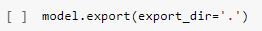  

TensorFlow inclut une classe de conversion qui nous permet de convertir un modèle Keras en un modèle TensorFlow Lite. Le modèle TensorFlow Lite est stocké en tant que FlatBuffer , ce qui est utile pour lire de gros morceaux de données une pièce à la fois (plutôt que de devoir tout charger dans la RAM). Autrement dit, c'est ce qui nous permettra de charger le modèle et de l'utiliser pour l'inférence avec la bibliothèque TensorFlow Lite for Microcontrollers.

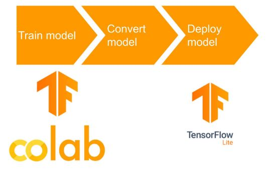  

Voici la structure détaillée du modèle:

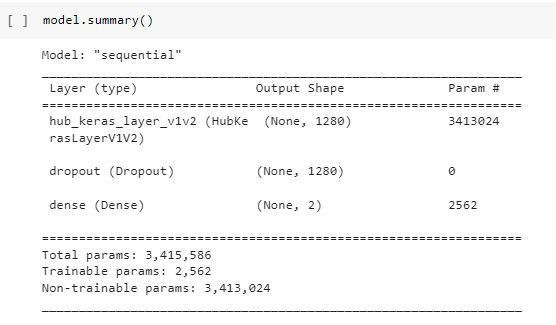  

On obtient au final un fichier "model .tflite" (dans le dossier '/content/') , mais la plupart des appareils intégrés n'ont pas de système de fichiers. Pour accéder aux données sérialisées de notre programme, nous devons les compiler dans l'exécutable et les stocker en Flash. La façon la plus simple de le faire est de convertir le fichier en un fichier .cc .

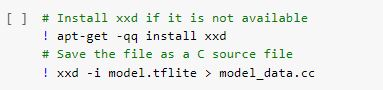  

Le fichier "model .cc"  obtenu va être intégré dans la bibliothéque Arduino pour utiliser le modèle.

 On remarque, néanmoins, que la taille du modèle est énorme (24 125 kB) par rapport au modèle de person_detection.
On a utilisé Tensorflow light pour la génération du modèle. Plus précisément, on a utilisé le modèle de classification d'images *efficientnet_lite0*. 
La famille de modèles de réseaux de neurones EfficientNet a été conçue pour une meilleure performance en termes de vitesse et de consommation de ressources pour les applications mobiles et l'Internet des objets. Il se concentre sur une optimisation efficace de la largeur et de la profondeur du réseau pour atteindre un équilibre entre la précision et les coûts de calcul(stockage).

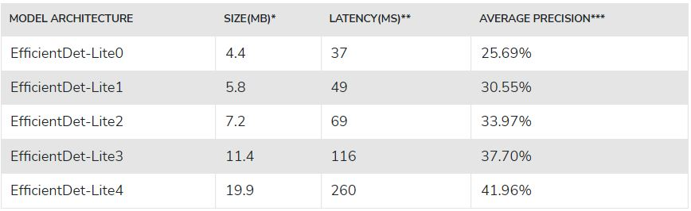  

Et malgré ceci, la taille du modèle (25125 kB) dépasse la RAM(256 kB) de la carte. 
J'ai choisi alors de changer le modèle et d'utiliser MobileNet-V2-Spec (c'esr ce que j'ai fait sur EDGE IMPULSE). C'est une spécification pour un modèle de réseau neuronal convolutionnel conçu pour les appareils mobiles et l'Internet des objets (IoT). C'est une version améliorée de MobileNet-V1, qui a été conçue pour être plus rapide et plus efficace en termes de consommation de ressources. Le MobileNet-V2-Spec utilise une approche de conception innovante appelée "inverted residuals" pour améliorer les performances du modèle. Il se concentre sur l'obtention d'un équilibre entre la précision et les coûts de calcul pour les applications mobiles et IoT à faible consommation de ressources.

Pour le faire et personnaliser par la suite notre modèle, on modifie hyperparamètres. Je les ai fixé aux mêmes paramètres utilisés précédemment dans edge impulse:
- model_spec: MobileNet-V2
- dropout_rate: La fraction des unités d'entrée à supprimer. Utilisé dans la couche de suppression. La valeur par défaut est 0,05.
- learning_rate: Le taux d'apprentissage à utiliser pour l'entraînement en descente de gradient. La valeur par défaut est 0,004.
- do_data_augmentation: si l'ensemble de données d'apprentissage est augmenté ou non en appliquant des transformations aléatoires telles que le recadrage, le retournement, etc. Voir utils.image_preprocessing pour plus de détails. La valeur par défaut est Vrai.
- epochs: nombre d'itérations d'entraînement sur l'ensemble de données. La valeur par défaut est 10. Mais on l'a déjà fixé à 20. 

Vous pouvez trouver une explication détaillée sur [ce site][df6]. 

On passe alors de cette commande: 
```sh
model = image_classifier.create(train_data, model_spec=model_spec.get('efficientnet_lite0'), validation_data=validation_data, epochs = 20)
  ```
à cette commande : 
```sh
model2=image_classifier.create(train_data, model_spec=mobilenet_v2_spec , validation_data=validation_data, epochs = 20, dropout_rate=0.1, learning_rate=0.004,do_data_augmentation)
  ```
Afin de réduire la taille de modèle, il est commode de l'optimiser. La quantification post-formation est une technique de conversion qui peut réduire la taille du modèle et la latence d’inférence, tout en améliorant la latence du processeur et de l’accélérateur matériel, avec peu de dégradation de la précision du modèle. 
Model Maker prend en charge plusieurs options de quantification post-formation. Prenons la quantification entière comme une instance. Tout d'abord, il faut configurer la configuration de quantification pour appliquer la quantification complète pour toutes les opérations, y compris les entrées et les sorties. Le type d’entrée et le type de sortie sont uint8 par défaut. Il est également possible de les modifier pour d'autres types tels que int8 en définissant inference_input_type et inference_output_type dans la configuration.

On ajoute alors au notebook :

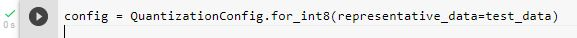  

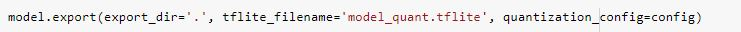  

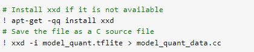  

#### 3-2-3- Partie Arduino (Méthode2) 
Dans cette partie et pour déployer le modèle, on va utiliser directement le fichier "model .cc". j'ai choisi dans cette partie d'utiliser un code exemple qui existe déjà qui est *person_detection* de la bibilothéque Harvard_Tiny_MLx. Il s'agit aussi d'une classification binaire et une détection de la présence ou absence d'un sujet bien précis. 
On ajoute alors "model.cpp" dans le dossier de projet. En conséquence, on change quelques paramètres dans le code Arduino ainsi que dans tous les fichiers du projet.

#### 3-2-4- Résultat (Méthode2) 
Même après le changement de spec et l'optimisation, je n'ai pas réussi à réduire la taille du modèle. En principe on devrait avoir les mêmes résultats que dans  3.1.4- Résultat(Méthode1).
J'ai mis le code que j'ai modifié dans le dossier de la deuxième méthode.

## Ressources :
- https://docs.arduino.cc/tutorials/nano-33-ble-sense/edge-impulse
- https://docs.edgeimpulse.com/docs/development-platforms/officially-supported-mcu-targets/arduino-nano-33-ble-sense 
- https://docs.edgeimpulse.com/experts/machine-learning-prototype-projects/tinyml-gastroscopic-image-processing
- https://github.com/PacktPublishing/TinyML-Cookbook 
- https://docs.arduino.cc/tutorials/nicla-vision/image-classification
- https://github.com/gigwegbe/tinyml-papers-and-projects
- https://www.arducam.com/product/1-9-ov7675-standalone-vga-coms-camera-module-b0316/
- https://pijaeducation.com/arduino/how-to-take-output-from-arduino-uno/led-brightness-control-using-arduino/
- https://docs.edgeimpulse.com/docs/development-platforms/officially-supported-mcu-targets/arduino-nano-33-ble-sense#2-update-the-firmware 
- https://www.tensorflow.org/lite/models/modify/model_maker/image_classification
- https://www.digikey.fr/en/maker/projects/intro-to-tinyml-part-1-training-a-model-for-arduino-in-tensorflow/8f1fc8c0b83d417ab521c48864d2a8ec
- https://notebook.community/frreiss/tensorflow-fred/tensorflow/lite/g3doc/tutorials/model_maker_image_classification
- https://levelup.gitconnected.com/custom-image-classification-model-using-tensorflow-lite-model-maker-68ee4514cd45
- https://github.com/tensorflow/tflite-micro/blob/main/tensorflow/lite/micro/examples/person_detection/training_a_model.md 
- https://www.tensorflow.org/lite/api_docs/python/tflite_model_maker/image_classifier/create
- https://gilberttanner.com/blog/tflite-model-maker-object-detection/
- https://www.tensorflow.org/api_docs/python/tf/lite/Optimize 
- https://www.tensorflow.org/lite/api_docs/python/tflite_model_maker/config/QuantizationConfig


[df1]: https://tinyml.seas.harvard.edu/assets/other/4D/22.03.11_Marcelo_Rovai_Handout.pdf 
[df2]:https://www.kaggle.com/datasets/nodoubttome/skin-cancer9-classesisic
[df3]: https://figshare.com/articles/dataset/Texture_Patch_Dataset_zip/6091007
[df4]: https://docs.arduino.cc/static/bdb53f29f29a67b0df0243b265617e7b/ABX00031-datasheet.pdf
[df5]:https://colab.research.google.com/drive/1NlAsw3tR_T_UgY3xG1TBVnT_BO1EsCAH?usp=sharing 
[df6]:https://developers.google.com/mediapipe/solutions/vision/image_classifier/customize
